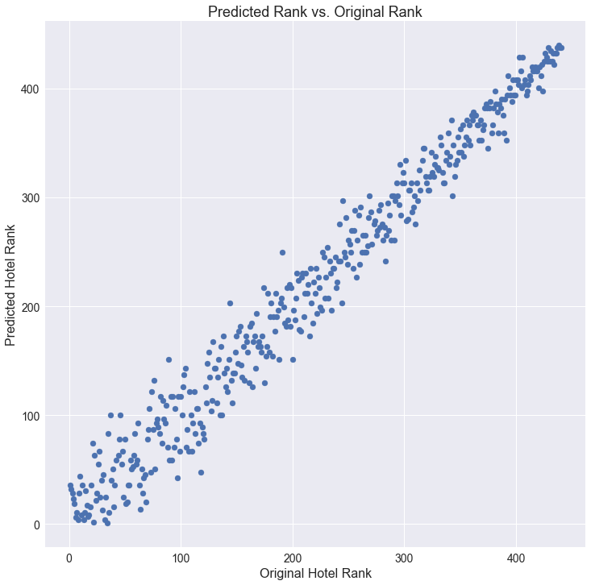
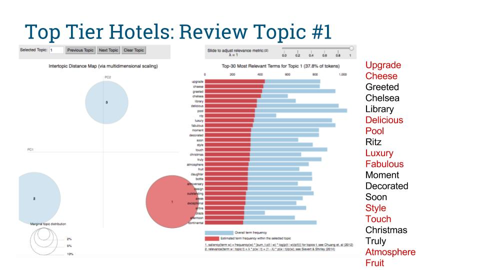
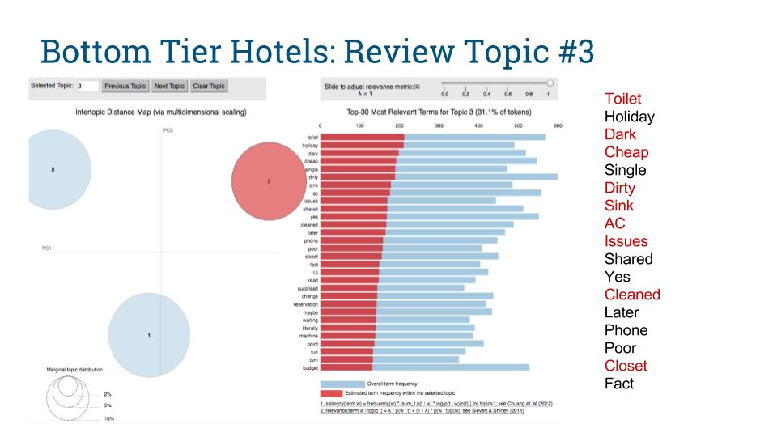

# How Can Hotels Predict and Improve Their Popularity Rankings on TripAdvisor?

## Introduction

For my Capstone Project I chose to examine hotel popularity rankings on the travel site TripAdvisor and to build some data-driven recommendations on how hotels can improve their rankings.

What are the popularity rankings I am talking about?  On the partial screenshot of the New York City hotel listings page below, you can see two hotels with their Traveler Popularity Rankings.  There is the top hotel, named 414 Hotel, and a different hotel that is shown here because TripAdvisor sells sponsored listings that allow hotels to be shown at the top of the list.

There are other ways that travelers can sort hotels, but the Traveler Ranked sort order is the default sort order.  As you can imagine, hotels are interested in being ranked high, so that there is a higher likelihood that travelers will see them when they look for hotels and choose to book a stay at their property.

There are in fact specific factors that go into TripAdvisor’s formula for computing the rankings: number, quality and age of reviews. But even though hotels can ask their guests to leave reviews upon check-out, this applies to all hotels, and since hotel rankings are relative, there is still a lot of uncertainty left as to how high a certain hotel will be ranked, and it is hard for hotels to compete just based on the number of reviews they may or may not get.  Going back to the screenshot example, you can see that the sponsored hotel has a lot more reviews and an identical quality of reviews, but that hotel is only ranked 57th and had to resort to buying this sponsored listing.

So the intended value of this project is to provide hotels with insight into more tangible, discriminating, and modifiable predictors of their ranks.

## Data Collection

All the data that I used for this project came from the TripAdvisor website.  I chose to work with NYC hotels and wrote web scraping (Scrapy) code to collect data on hotel characteristics and the reviews they have received, placing the data in a PostgreSQL database.  Collected hotel features included: name, address, amenities, star rating, number of rooms, and price range.   Review data included review text, review date, month of stay, type of travel, and bubble rating.  There were 467 hotels identified in NYC under and I scraped a total of 100,000 reviews from their pages.

## Preprocessing

As part of data cleansing, I implemented the following steps:
- Removed 17 hotels without a rank and 4 hotels outside of Manhattan
- Cleaned hotel addresses to allow all of them to be geocoded and plotted on a map
- Imputed missing values of number of rooms in hotel (6), hotel's star rating (28), and price range (22) using k-Nearest Neighbors (after imputation I rounded star rating values to the nearest 0.5 to allow for categorical treatment of that feature)
- Removed reviews without text content or without hotel stay summary (< 2% of all reviews)
- Removed 6 hotels without any reviews
- Cleaned review text & aggregated reviews to hotel level

The final hotel count ended up being 440.  I shifted hotel ranks to fill any gaps created by removing the 27 hotels above.

I geocoded all hotel addresses using Google Maps API (with the help of the Geocoder package).

## Exploratory Data Analysis

Before building my predictive models, I undertook exploratory data analysis to see if I could uncover any evidence of a relationship between the rank of a hotel and its other attributes.  As you can see in the box plot below, the main relationship that I uncovered is that hotels with higher star ratings are more likely to have better popularity rankings.  This surprised me somewhat, as this suggests that in rating hotels, travelers at least in the NYC market prioritize amenities, luxury and comfort over value.

But what also stood out here is the presence of outliers (particularly at the top of the rankings) and I decided to study these outliers individually to see if I could formulate any additional hypotheses.  After browsing hotel reviews, the top hotels that stood out among their class-rating peers appeared to be small boutique hotels that offer unique and welcoming experience.  It is possible then that those are important features that can drive a hotel to the top of the rankings and should be incorporated in the model.

But then I also examined the distribution of room price ranges within each star rating class.  As shown in the plot below, the hotels that out-performed their class-rating peers with their rank are the same hotels that charge more for the rooms relative to the other hotels in their class.  This suggests that those hotels perform so well not necessarily because of offering a warm and welcoming experience to their guests, but perhaps because they offer more amenities or services that put them on par with higher-class hotels.

Another hypothesis that I explored is the association between hotel's location and its ranking.  It is likely that a hotel will be rated highly by its guests not just because of what the hotel itself offers, but because of where it is situated.  But after plotting all hotels on the map of Manhattan (using QGIS open-source application), I did not notice this type of relationship.

The highest-ranked hotel (1-100), marked in red on this map, exhibit a very similar spatial distribution to hotels 101-200 (yellow dots), 201-300 (purple), and 301-440 (green).  Given these findings, and given that Manhattan is so compact and it is easy to get around from place to place, I did not investigate the geospatial question any further.

Lastly, I explored the temporal dimension of hotel rankings by examining if the ratings left by guests vary over time, which would suggest that hotels undertake efforts to improve their service/customer experience and their rankings may change as a result of those efforts.  For this, I plotted average monthly ratings of all hotels that had at least three years of review data.  The story I uncovered was that hotels' ratings do not increase or decrease dramatically over time.  The three examples shown below indicate that hotel's ranking is largely a function of time-invariant hotel attributes.

## Modeling

Rather than working with a small dataset of 440 hotels, I converted it into a much larger dataset where each row contains a unique pairing of two hotels and all of the features of those two hotels.  This means that I created 440-choose-2 combinations, or 96,580 pairings.  For each pairing I added a 1/0 classification label indicating whether the first or second hotel in the pairing was ranked higher.

Based on the EDA described above, I chose the following features as my predictors:
- 9 hotel star rating dummy variables (1, 1.5, ..., 5)
- 10 amenities dummy variables (WiFi, Room Service, Restaurant, Bar/Lounge, Gym, Spa, Breakfast, Pool, Internet, Parking)
- number of rooms in hotel
- low and high ends of hotel's price range
- 31 zipcode dummy variables

There was a total of 106 predictors, or 53 per hotel in each pairing.

I chose a 2/3 - 1/3 train-test split for the models.

The results of the classification models, all of which used hyperparameter grid search, are shown below:

Baseline (Test data): 50.44%

| Model                     | Best Model CV | Full Train Score | Test Score |
|---------------------------|---------------|------------------|------------|
| Logistic Regression       | 76.02%        | 76.19%           | 76.10%     |
| Stochastic Grad Descent   | 75.96%        | 76.08%           | 75.89%     |
| Random Forest             | 89.74%        | 97.44%           | 90.10%     |
| XGBoost                   | 96.24%        | 99.04%           | 96.72%     |

| Model                     | Precision | Recall | F-1   |
|---------------------------|-----------|--------|-------|
| Logistic Regression       | 0.76      | 0.75   | 0.76  |
| Stochastic Grad Descent   | 0.76      | 0.74   | 0.75  |
| Random Forest             | 0.90      | 0.90   | 0.90  |
| XGBoost                   | 0.97      | 0.97   | 0.97  |

XGBoost clearly provides the best results, so I used its output to derive predicted ranks from pairwise comparisons.  I implemented this by taking each hotel and counting hotels predicted to be ranked lower than that hotel in pairwise comparisons.  Then I sorted all hotels by that count in descending order and assigned ranks from top to bottom.  I used the Pandas DataFrame Rank method to assign ranks, which assigns equal ranks to rows with equal values (equal to the average of the ranks of those values, e.g., two hotels tied for 8th would both be given the rank of 8.5).

The plot below compares actual and predicted ranks in the test data.  The Spearman Rank-Order correlation coefficient is 0.9862.

## Review Text Topic Modeling

While I was able to achieve high accuracy of rank prediction with only hotel-level features, I felt I could gain additional insight or at least corroborate my findings by analyzing the reviews left by travelers.  For this I used the Latent Dirichlet Allocation (LDA) statistical model to identify topics discussed in reviews of hotels in different tiers of rankings.  Topic modeling is a text-mining tool for discovering abstract "topics" that occur in a collection of documents.  Topics produced by topic modeling are clusters of similar words (e.g., a document about dogs may have a cluster/topic of "dog" and "bone").  The tiers I chose were similar to those used in geospatial analysis above: 1-100, 101-200, 201-300, and 301-400.

My preprocessing steps here included removing all punctuation from review text, changing all text to lowercase, and removing stopwords (e.g., however, somehow, perhaps) provided in Scikit-Learn's feature extraction.text class.  After some test runs, I also removed all words appearing more than 2,500 times across all reviews in one tier of hotels as those words were too common and appeared in all resulting topics.

I used the PyLDAvis package to visualize the topics.  As you can see below, the results are consistent with the EDA and modeling results above.  Reviews of top-tier hotels discuss luxury-related topics, while reviews of bottom-tier hotels discuss basic expectations of hotels, including cleanliness and lighting.

## Conclusion

The key takeaway from this modeling project is that, at least in the NYC market, price/luxury is the strongest predictor of hotel's popularity ranking on TripAdvisor.  Hotels can use these results, including review topics, to help them decide which amenities/features to offer to guests, or whether it is worth making those types of investments at all over buying sponsored listings on TripAdvisor.

Future iterations of this data product may incorporate data from other cities and historical ranking data for hotels, such that it becomes more clear whether NYC is a special market and how much time a hotel can expect to hold a certain place in the rankings or to move up to the top tier.
